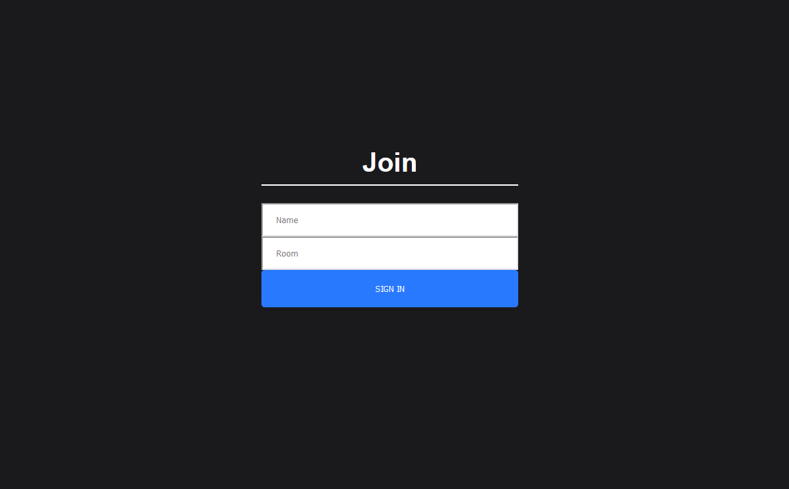
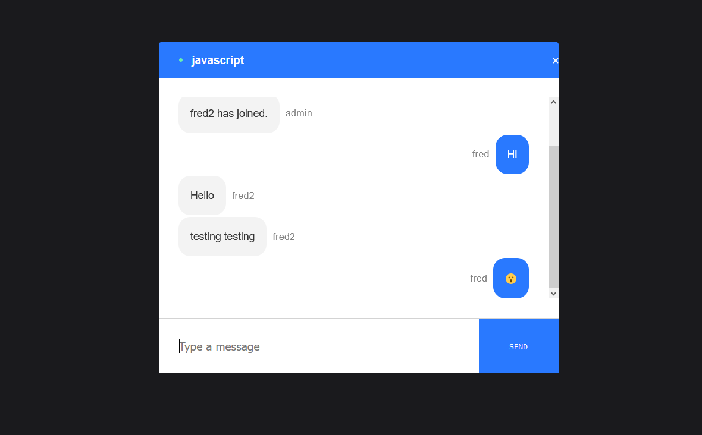

# Fredrealtimechat
  This is the first chat app I made, The porpuse was to learn websocket protocol through socket.io library. It has a back-end deployed to heroku and a front-end deployed to vercel.
  I had to configure CORS also to allow the back-end to receive and accept the incoming connections from vercel and nowhere else. 
  
   
    
